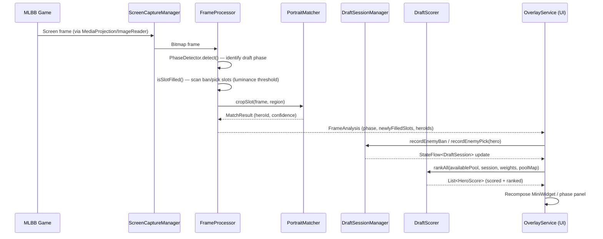
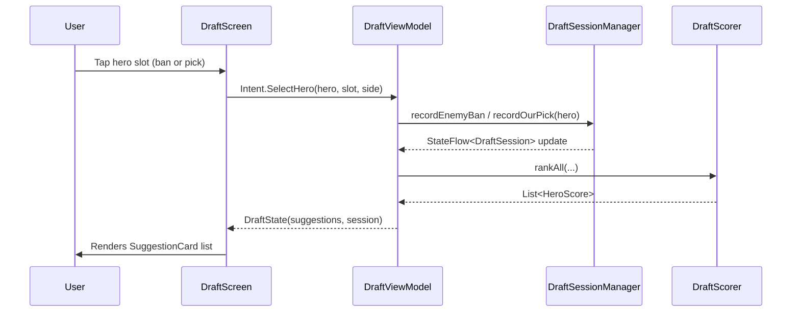
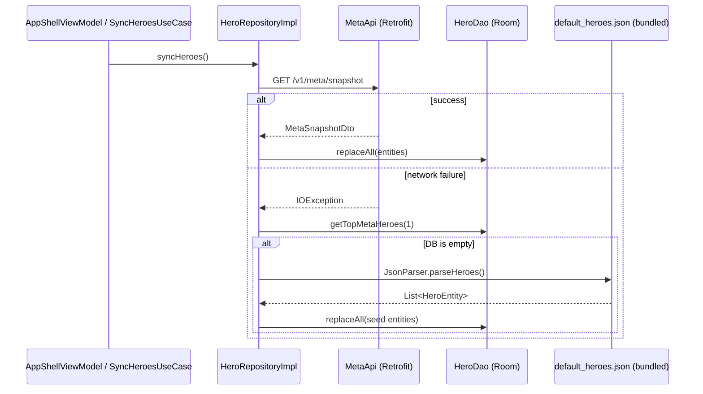
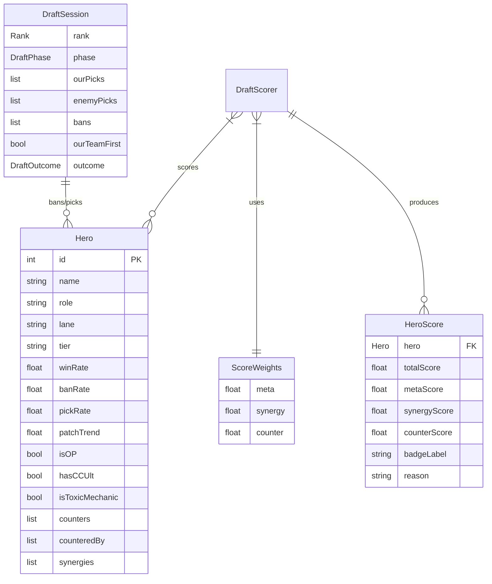

# Architecture Overview — MLBB Draft Assistant

> **Status:** Living document. Update whenever a module boundary, dependency, or
> data-flow contract changes. Last reconciled against source at `versionName 2.0.0`
> (`versionCode 2`). For audit findings see [`docs/temp/findings.md`](./temp/findings.md).

---

## 1. What the app is

**MLBB Draft Assistant** is a native Android application that provides real-time,
explainable drafting guidance for *Mobile Legends: Bang Bang* during the hero
ban/pick phase. It renders an always-on floating overlay on top of the game,
uses a computer-vision pipeline (MediaProjection + perceptual hashing) to detect
picks and bans autonomously, and surfaces ranked hero recommendations scored by
meta strength, synergy, and counter value.

| Attribute | Value |
|---|---|
| Package | `com.mlbb.assistant` |
| Min SDK | 29 (Android 10) |
| Target / Compile SDK | 36 |
| Language | Kotlin 2.1.0 |
| Build | AGP 8.10.1, Gradle KTS, version catalog |
| UI | Jetpack Compose + Material 3 (BOM 2025.05.01) |
| Module layout | Single Gradle module `:app` (root project `MLBB Assistant 2.0`) |

---

## 2. Architectural style

The app follows **Clean Architecture** with a **unidirectional data flow (MVI/UDF)**
presentation layer. The dependency rule is: `presentation → domain ← data`.
`domain/` has **zero Android imports** and is unit-testable on the JVM.

```
┌──────────────────────────────────────────────────────────────────────┐
│                          PRESENTATION                                  │
│  Jetpack Compose screens ── observe ──▶ StateFlow<UiState>             │
│  ViewModels (Hilt) ── emit intents ──▶ UseCases                       │
│  OverlayService (foreground) hosts the overlay Compose tree           │
└───────────────────────────────┬──────────────────────────────────────┘
                                 │ depends on (interfaces only)
┌───────────────────────────────▼──────────────────────────────────────┐
│                            DOMAIN  (pure Kotlin, no Android imports)   │
│  model/      Hero, Lane, Tier, Proficiency, DraftOutcome, ...         │
│  engine/     DraftSessionManager, RankRuleEngine, PickSequenceEngine, │
│              WeightCalibrator, DraftPatternAnalyzer                    │
│  scoring/    DraftScorer, ScoreWeights, HeroScore                     │
│  advisor/    CompositionAnalyzer, BanRecommender, BuildAdvisor,       │
│              EnemyIntentAnalyzer, WinConditionGenerator, ...          │
│  usecase/    GetSuggestions, SyncHeroes, SaveDraftSession, ...        │
│  repository/ HeroRepository, DraftSessionRepository (interfaces)      │
└───────────────────────────────┬──────────────────────────────────────┘
                                 │ implemented by
┌───────────────────────────────▼──────────────────────────────────────┐
│                              DATA                                      │
│  local/database/   Room v3: AppDatabase, DAOs, Entities, Converters   │
│  local/datastore/  Preferences DataStore (single delegate)            │
│  local/crashlog/   CrashLogStore + Timber AppLogTree                  │
│  remote/api/       Retrofit MetaApi (GET /v1/meta/snapshot)           │
│  remote/dto/       MetaSnapshotDto                                     │
│  repository/       HeroRepositoryImpl, DraftSessionRepositoryImpl      │
│  export/           DraftExporter                                       │
└───────────────────────────────┬──────────────────────────────────────┘
                                 │ feeds
┌───────────────────────────────▼──────────────────────────────────────┐
│                       CAPTURE / SERVICE (Android edge)                 │
│  capture/   FrameProcessor, PhaseDetector, PortraitMatcher,           │
│             PerceptualHash, RankDetector, SlotRegions, ...            │
│  service/   ScreenCaptureManager (MediaProjection), VoiceAlertService,│
│             MLBBAccessibilityService                                   │
└────────────────────────────────────────────────────────────────────────┘
```

---

## 3. System sequence diagram (Mermaid.js)

### 3.1 Autonomous detection happy path



### 3.2 Manual fallback path



### 3.3 Hero data sync (startup)



### 3.4 Scoring engine data flow (Entity Relationship)



---

## 4. Folder-structure tree

```
app/src/main/java/com/mlbb/assistant/
│
├── MLBBApplication.kt          Root Hilt application class; plants Timber tree + AppLogTree
├── AppDataStore.kt             Convenience accessor for the singleton DataStore delegate
│
├── capture/                    Computer-vision stack (Android edge; no domain imports)
│   ├── FirstPickDetector.kt    Infers which side has first-pick from screen region
│   ├── FrameProcessor.kt       Per-frame orchestrator: phase detect + slot scan + dedupe
│   ├── PerceptualHash.kt       dHash + histogram computation for portrait fingerprinting
│   ├── PhaseDetectionConfig.kt Centralised constants for all CV thresholds (TD-03)
│   ├── PhaseDetector.kt        Classifies draft phase from banner pixel colours
│   ├── PhaseOcrDetector.kt     OCR disambiguation for ban round 1 vs 2
│   ├── PortraitMatcher.kt      Hybrid dHash+histogram match against preloaded hashes (TD-08)
│   ├── RankDetector.kt         Infers rank tier from emblem region
│   └── SlotRegions.kt          Normalised (0–1) rectangles for all ban/pick/action slots
│
├── data/
│   ├── export/
│   │   └── DraftExporter.kt    Serialises a DraftSession for share-sheet output
│   ├── local/
│   │   ├── crashlog/
│   │   │   ├── AppLogTree.kt   Timber tree; routes ERROR/WTF to CrashLogStore (TD-11)
│   │   │   └── CrashLogStore.kt File-backed rolling log; Mutex-guarded writes
│   │   ├── database/
│   │   │   ├── AppDatabase.kt  Room v3; exportSchema=true; single construction path
│   │   │   ├── Converters.kt   TypeConverters for List<Int>, List<String>, enums
│   │   │   ├── DraftSessionDao.kt  Insert / query / delete for draft history
│   │   │   ├── DraftSessionEntity.kt  Flat DB representation of DraftSession
│   │   │   ├── HeroDao.kt      Flow + suspend queries; PagingSource for hero grid (TD-10)
│   │   │   ├── HeroEntity.kt   DB-layer hero with toDomain() / toEntity() symmetry
│   │   │   ├── HeroPoolDao.kt  Proficiency-keyed hero pool table
│   │   │   └── HeroPoolEntity.kt  heroId + Proficiency level
│   │   ├── datastore/
│   │   │   └── PreferencesDataStore.kt  Typed DataStore flows: weights, wizard flags, etc.
│   │   └── preferences/
│   │       └── WizardPreference.kt  Onboarding step completion flags
│   ├── remote/
│   │   ├── api/MetaApi.kt      Retrofit interface: GET /v1/meta/snapshot
│   │   └── dto/MetaSnapshotDto.kt  Wire model + toEntity() mapping
│   └── repository/
│       ├── DraftSessionRepositoryImpl.kt  Insert + query; enforces single-write-path rule
│       └── HeroRepositoryImpl.kt  Network-with-seed-fallback; Paging3 source (TD-10)
│
├── di/                         Hilt DI modules (all SingletonComponent)
│   ├── AppModule.kt            DataStore singleton, DraftSessionManager, VoiceAlertService
│   ├── DatabaseModule.kt       AppDatabase with MIGRATION_1_2 + MIGRATION_2_3; all DAOs
│   ├── NetworkModule.kt        OkHttpClient (RetryInterceptor), Retrofit, Gson, MetaApi
│   ├── OverlayModule.kt        OverlayController binding
│   └── RepositoryModule.kt     Interface → impl bindings (HeroRepo, DraftSessionRepo)
│
├── domain/                     Pure Kotlin; zero android.* imports
│   ├── OverlayController.kt    Interface: toggleOverlay() — decouples use cases from Service
│   ├── advisor/
│   │   ├── BanRecommender.kt           Prioritised ban list from enemy threat + meta
│   │   ├── BuildAdvisor.kt             3 core + 3 situational items per hero/context
│   │   ├── CompositionAnalyzer.kt      Archetype, damage profile, CC/mobility/sustain
│   │   ├── CompositionArchetype.kt     Enum: BURST_HEAVY, POKE, TEAMFIGHT, etc.
│   │   ├── DraftScoreCalculator.kt     Aggregate session score + key insight bullets
│   │   ├── EnemyIntentAnalyzer.kt      Infers enemy strategy from picks so far
│   │   └── WinConditionGenerator.kt    Generates "your team wins if…" statements
│   ├── engine/
│   │   ├── DraftPatternAnalyzer.kt     Historical tendency analysis (over-ban, under-roam)
│   │   ├── DraftSessionManager.kt      StateFlow<DraftSession>; ban/pick/undo/swap/outcome
│   │   ├── PickSequenceEngine.kt       1-2-2-2-2-1 turn model; first/last-pick flags
│   │   ├── RankRuleEngine.kt           Ban count structures per rank; rank string parser
│   │   └── WeightCalibrator.kt         Adjusts ScoreWeights from win/loss history
│   ├── model/
│   │   ├── DraftHistoryItem.kt         Projection of a saved draft session for history UI
│   │   ├── DraftOutcome.kt             WIN / LOSS / UNKNOWN
│   │   ├── Hero.kt                     Core domain entity (stats, counters, synergies, flags)
│   │   └── Proficiency.kt              UNRANKED / OCCASIONAL / COMFORTABLE / MAIN
│   ├── repository/
│   │   ├── DraftSessionRepository.kt   Insert + query interface
│   │   └── HeroRepository.kt           CRUD + paged + search interface
│   ├── scoring/
│   │   ├── DraftScorer.kt              Multi-factor scorer; adaptive weights; dynamic bounds
│   │   ├── HeroScore.kt                Output: per-hero score + badge + reason
│   │   └── ScoreWeights.kt             Validated (sum=1.0) weight triple + presets
│   └── usecase/
│       ├── GetDraftHistoryUseCase.kt
│       ├── GetHeroesUseCase.kt
│       ├── GetPagedHeroesUseCase.kt
│       ├── GetSuggestionsUseCase.kt
│       ├── SaveDraftSessionUseCase.kt   Only writer to DraftSessionDao
│       ├── SyncHeroesUseCase.kt
│       └── ToggleOverlayUseCase.kt
│
├── presentation/
│   ├── common/
│   │   ├── components/          Shared: MLBBButton, HeroGrid, HeroPortrait, ConnectivityBanner…
│   │   └── theme/               Color.kt, Theme.kt, Type.kt (Material 3)
│   ├── draft/                   Manual draft screen + DraftViewModel + DraftState (@Immutable)
│   ├── herodetail/              Hero detail screen
│   ├── herolist/                Paged hero list + HeroListState (@Immutable)
│   ├── heropool/                Hero pool management (SavedStateHandle filter, TD-07)
│   ├── history/                 Draft history + replay viewer
│   ├── home/                    Home dashboard
│   ├── log/                     Debug log viewer (reads CrashLogStore)
│   ├── main/MainActivity.kt     ComponentActivity; screen-capture consent; overlay start
│   ├── metaboard/               Meta tier list display
│   ├── navigation/              AppNavGraph + AppRoute (sealed class routes)
│   ├── overlay/                 FloatingBubble, MiniWidget, DraftPanel, phase panels
│   │   └── OverlayService.kt    ~1,100 LOC foreground service (refactor target)
│   ├── settings/                Settings screen + SettingsState (@Immutable)
│   ├── shell/                   AppShell + AppShellViewModel
│   └── welcome/                 PermissionWizardScreen
│
├── service/
│   ├── MLBBAccessibilityService.kt  Detects MLBB foreground context
│   ├── ScreenCaptureManager.kt      Owns MediaProjection + ImageReader; emits Bitmap frames
│   └── VoiceAlertService.kt         TextToSpeech turn announcements
│
└── utils/
    ├── AppConstants.kt         Notification channel ID + notification ID constants
    ├── DateFormatter.kt        java.time only (DateTimeFormatter, thread-safe)
    ├── Extensions.kt           Kotlin extension helpers
    ├── JsonParser.kt           Bundles default_heroes.json parser (Gson)
    ├── NetworkMonitor.kt       ConnectivityManager flow for offline banner
    └── NetworkResult.kt        Sealed class: Loading / Success<T> / Error + fold helpers
```

---

## 5. The scoring engine (the heart of the product)

`DraftScorer.score(...)` produces a `HeroScore` per candidate. The formula:

$$\text{total} = \text{meta}\cdot w_m + \text{synergy}\cdot w_s + \text{counter}\cdot w_c + \text{role}\cdot 0.15 + \text{flex}\cdot 0.10 + \text{safe}\cdot 0.10$$

clamped to `[0, 1]`, then multiplied by the personal-pool proficiency multiplier.

- **Weights** (`ScoreWeights`) default to meta **0.40** / synergy **0.30** /
  counter **0.30**, validated to sum to 1.0 at construction.
- **Adaptive weights:** as the draft progresses (`pickIndex / maxPickIndex`),
  meta weight decays and synergy + counter rise.
- **Dynamic bounds (TD-05):** `computeBounds()` derives win-rate median ± half-IQR
  and 90th-percentile ban/pick caps from the live pool.
- **Positional modifiers:** first-pick favours flexibility; last-pick favours safety.
- **Explainability:** every score carries a `badgeLabel` and a human `reason` string.

---

## 6. The draft state machine

`DraftPhase`: `IDLE → SETUP → BAN_ROUND_1 → (BAN_ROUND_2) → PICK → TRADING → COMPLETE`

- `RankRuleEngine` encodes ban structures: Epic & below = 6 bans; Legend = 8; Mythic+ = 10.
- `PickSequenceEngine` models the **1-2-2-2-2-1** turn order.
- `DraftSessionManager` is the single mutator: bans/picks, undo stack, swaps, outcome.

---

## 7. Persistence & storage

| Store | Tech | Contents |
|---|---|---|
| Relational | Room v3 | `heroes`, `draft_sessions`, `hero_pool` |
| Key-value | DataStore Preferences | Settings, wizard progress, bubble position, score weights, session snapshot |
| Files | `CrashLogStore` | Rolling crash/debug logs (mutex-guarded) |

**Migrations:** 1→2 (`hasCCUlt` column added to heroes); 2→3 (verified). Schema JSON
exported under `/schemas/` and committed for safe future migrations.

**Seed & fallback data:**
- `res/raw/default_heroes.json` (~73 KB) — bundled hero roster used when network sync fails and DB is empty.
- `assets/draft_ui_map.json` (~7 KB) — screen-region coordinate map for the CV pipeline.

---

## 8. Cross-cutting decisions (the "why")

1. **Domain purity** — no Android in `domain/` so the engine is JVM-unit-testable.
2. **Single DataStore delegate** — exactly one `preferencesDataStore` prevents the multiple-delegate `IllegalStateException`.
3. **Single DB construction path** — `DatabaseModule` only; the companion factory that bypassed migrations was removed.
4. **`toEntity()` mirrors `toDomain()`** — mapping symmetry is a maintenance invariant; adding a field requires updating both.
5. **`java.time` only** — `DateFormatter` uses `DateTimeFormatter` (thread-safe); `SimpleDateFormat` is banned.
6. **Explicit IO dispatch (TD-06)** — repository suspend functions wrap `withContext(Dispatchers.IO)` defensively.
7. **Config-driven CV (TD-03/04)** — all detection thresholds live in `PhaseDetectionConfig`.
8. **Foreground-service correctness** — two-step FGS start: `SPECIAL_USE` in `onCreate`, `MEDIA_PROJECTION` added only after user grants projection token (Android 14+ compliant).
9. **TD-xx tagging scheme** — technical debt is annotated in source at the fix site and registered in [`todo.md`](./todo.md) §1.

---

## 9. Build, tooling & dependencies

- **Version catalog:** `gradle/libs.versions.toml` — single source of truth.
- **Key libraries:** Hilt 2.55, Room 2.7.1, Retrofit 2.11 + OkHttp 4.12, Coil 3.1, Paging 3.3.6, DataStore 1.1.4, Coroutines 1.10.1, Timber 5.0.1, Navigation Compose 2.9.0.
- **Test stack:** JUnit4, MockK, Turbine, coroutines-test, Robolectric; Espresso + Compose UI test for instrumentation.
- **Release build:** R8 minify + resource shrink + ProGuard rules. Full-mode R8 enabled.
- **API base URL:** `BuildConfig.META_API_BASE_URL`, overridable per variant.

---

## 10. Localization

String resources are localized into Filipino (`values-fil`), Indonesian (`values-in`),
Malay (`values-ms`), Thai (`values-th`), and Vietnamese (`values-vi`) — the core MLBB
markets — alongside default English (`values`, ~75 strings).

---

## 11. Known limitations / sharp edges

- `OverlayService` is large (~1,100 LOC) and mixes service lifecycle, window management, and UI hosting — see `todo.md` §3.
- CV detection accuracy depends on device resolution and ROM; `SlotRegions` / `draft_ui_map.json` may need recalibration per aspect ratio.
- `MetaApi` has no auth or response caching layer beyond the local DB fallback.
- `Bitmap.getPixel()` in luminance loops is a performance bottleneck; see `docs/temp/findings.md` P1-01.
- `Thread.sleep` in `RetryInterceptor` blocks OkHttp thread-pool threads; see `docs/temp/findings.md` P1-02.
