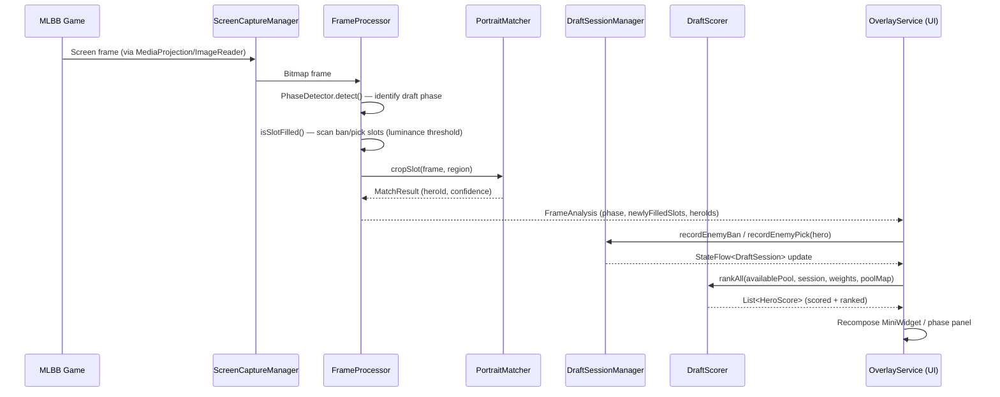
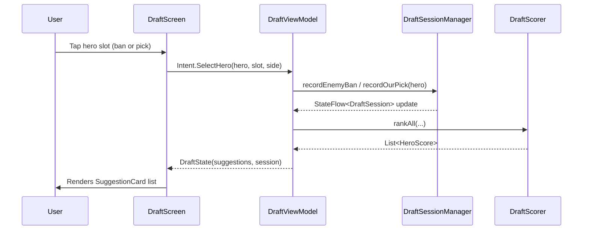
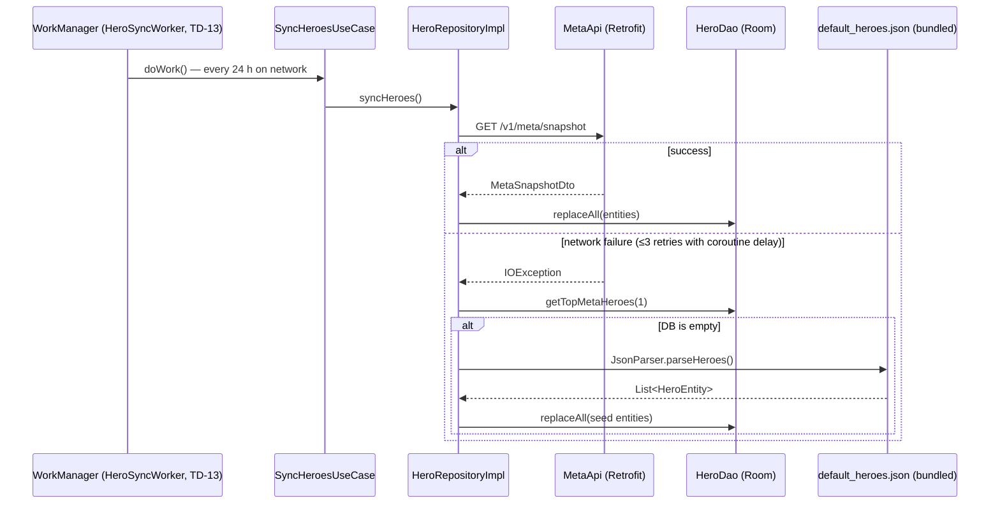
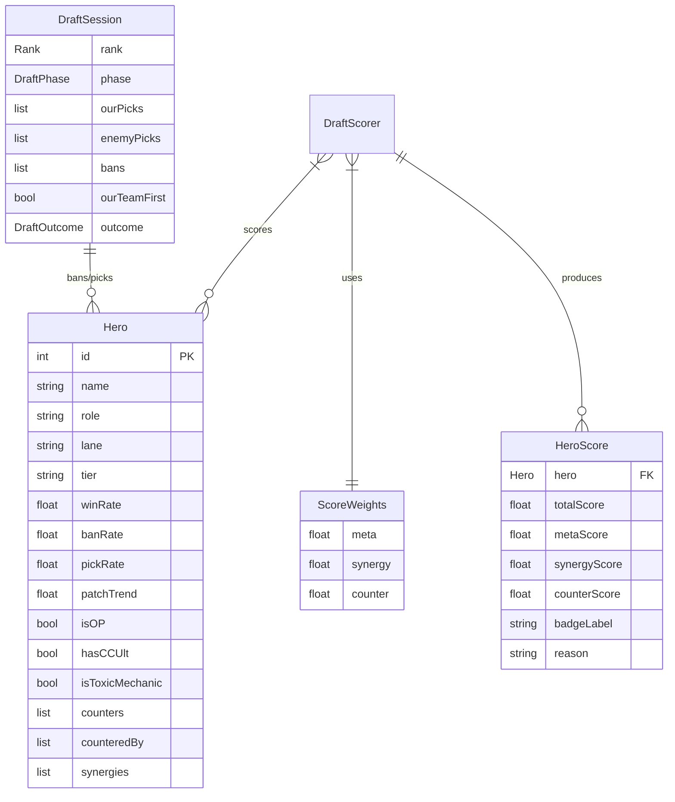

# Architecture Overview — MLBB Draft Assistant

> **Status:** Living document. Update whenever a module boundary, dependency, or
> data-flow contract changes.
>
> Version: `2.0.0` (versionCode 2) · Last updated: 2026-06-28
>
> For audit findings see [`docs/temp/findings.md`](./temp/findings.md).

---

## 1. What the app is

**MLBB Draft Assistant** is a native Android application that provides real-time,
explainable drafting guidance for *Mobile Legends: Bang Bang* during the hero
ban/pick phase. It renders an always-on floating overlay on top of the game,
uses a computer-vision pipeline (MediaProjection + perceptual hashing) to detect
picks and bans autonomously, and surfaces ranked hero recommendations scored by
meta strength, synergy, and counter value.

| Attribute | Value |
|---|---|
| Package | `com.mlbb.assistant` |
| Min SDK | 29 (Android 10) |
| Target / Compile SDK | 36 |
| Language | Kotlin 2.1.0 |
| Build | AGP 9.2.1, Gradle KTS, version catalog |
| UI | Jetpack Compose + Material 3 (BOM 2026.06.00) |
| Module layout | Single Gradle module `:app` (root project `MLBB Assistant 2.0`) |

---

## 2. Architectural style

The app follows **Clean Architecture** with a **unidirectional data flow (MVI/UDF)**
presentation layer. The dependency rule is: `presentation → domain ← data`.
`domain/` has **zero Android imports** and is unit-testable on the JVM.

```
┌──────────────────────────────────────────────────────────────────────┐
│                          PRESENTATION                                  │
│  Jetpack Compose screens ── observe ──▶ StateFlow<UiState>             │
│  ViewModels (Hilt) ── emit intents ──▶ UseCases                       │
│  OverlayService (foreground) hosts the overlay Compose tree           │
└───────────────────────────────┬──────────────────────────────────────┘
                                 │ depends on (interfaces only)
┌───────────────────────────────▼──────────────────────────────────────┐
│                            DOMAIN  (pure Kotlin, no Android imports)   │
│  model/      Hero, Lane, Tier, Proficiency, DraftOutcome, ...         │
│  engine/     DraftSessionManager, RankRuleEngine, PickSequenceEngine, │
│              WeightCalibrator, DraftPatternAnalyzer                    │
│  scoring/    DraftScorer, ScoreWeights, HeroScore                     │
│  advisor/    CompositionAnalyzer, BanRecommender, BuildAdvisor,       │
│              EnemyIntentAnalyzer, WinConditionGenerator,              │
│              HeroArchetypeService, TraitCounterEngine,                │
│              BanValueScorer, BanUrgencyScorer                         │
│  usecase/    GetSuggestions, SyncHeroes, SaveDraftSession, ...        │
│  repository/ HeroRepository, DraftSessionRepository (interfaces)      │
└───────────────────────────────┬──────────────────────────────────────┘
                                 │ implemented by
┌───────────────────────────────▼──────────────────────────────────────┐
│                              DATA                                      │
│  local/database/   Room v4: AppDatabase, DAOs, Entities, Converters,  │
│                    CounterLookupEntity, CounterLookupDao               │
│  local/datastore/  Preferences DataStore (single delegate)            │
│  local/crashlog/   CrashLogStore + Timber AppLogTree                  │
│  remote/api/       Retrofit MetaApi (GET /v1/meta/snapshot)           │
│  remote/dto/       MetaSnapshotDto                                     │
│  repository/       HeroRepositoryImpl, DraftSessionRepositoryImpl      │
│  export/           DraftExporter                                       │
│  worker/           HeroSyncWorker (WorkManager + HiltWorker, TD-13)   │
└───────────────────────────────┬──────────────────────────────────────┘
                                 │ feeds
┌───────────────────────────────▼──────────────────────────────────────┐
│                       CAPTURE / SERVICE (Android edge)                 │
│  capture/   FrameProcessor, PhaseDetector, PortraitMatcher,           │
│             PerceptualHash, RankDetector, SlotRegions, ...            │
│  service/   ScreenCaptureManager (MediaProjection), VoiceAlertService,│
│             MLBBAccessibilityService                                   │
└────────────────────────────────────────────────────────────────────────┘
```

---

## 3. System sequence diagrams

### 3.1 Autonomous detection happy path



### 3.2 Manual fallback path



### 3.3 Hero data sync (startup + periodic background)



### 3.4 Scoring engine data flow (Entity Relationship)



---

## 4. Folder-structure tree

```
app/src/main/java/com/mlbb/assistant/
│
├── MLBBApplication.kt          Root Hilt application class; plants Timber tree + AppLogTree;
│                               configures HiltWorkerFactory; schedules HeroSyncWorker (TD-13);
│                               calls JetOverlay.initialize()
├── AppDataStore.kt             Convenience accessor for the singleton DataStore delegate
│
├── capture/                    Computer-vision stack (Android edge; no domain imports)
│   ├── FirstPickDetector.kt    Infers which side has first-pick from screen region
│   ├── FrameProcessor.kt       Per-frame orchestrator: phase detect + slot scan + dedupe
│   │                           All slot sets use ConcurrentHashMap.newKeySet()
│   ├── PerceptualHash.kt       dHash + histogram computation for portrait fingerprinting
│   ├── PhaseDetectionConfig.kt Centralised constants for all CV thresholds (TD-03)
│   ├── PhaseDetector.kt        Classifies draft phase from banner pixel colours
│   ├── PhaseOcrDetector.kt     OCR disambiguation for ban round 1 vs 2 (ML Kit Text Rec.)
│   ├── PortraitMatcher.kt      Hybrid 4-algorithm match against preloaded hashes (TD-08)
│   ├── RankDetector.kt         Infers rank tier from emblem region
│   └── SlotRegions.kt          Normalised (0–1) rectangles for all ban/pick/action slots
│
├── data/
│   ├── export/
│   │   └── DraftExporter.kt    Serialises a DraftSession for share-sheet output
│   ├── local/
│   │   ├── crashlog/
│   │   │   ├── AppLogTree.kt   Timber tree; routes ERROR/WTF to CrashLogStore (TD-11)
│   │   │   └── CrashLogStore.kt File-backed rolling log; Mutex-guarded writes
│   │   ├── database/
│   │   │   ├── AppDatabase.kt  Room v3; exportSchema=true; single construction path
│   │   │   ├── Converters.kt   TypeConverters for List<Int>, List<String>, enums
│   │   │   ├── DraftSessionDao.kt  Insert / query / delete for draft history
│   │   │   ├── DraftSessionEntity.kt  Flat DB representation of DraftSession
│   │   │   ├── HeroDao.kt      Flow + suspend queries; PagingSource for hero grid (TD-10)
│   │   │   ├── HeroEntity.kt   DB-layer hero with toDomain() / toEntity() symmetry
│   │   │   ├── HeroPoolDao.kt  Proficiency-keyed hero pool table
│   │   │   └── HeroPoolEntity.kt  heroId + Proficiency level
│   │   ├── datastore/
│   │   │   └── PreferencesDataStore.kt  Typed DataStore flows: weights, wizard flags, etc.
│   │   └── preferences/
│   │       └── WizardPreference.kt  Onboarding step completion flags
│   ├── remote/
│   │   ├── api/MetaApi.kt      Retrofit interface: GET /v1/meta/snapshot
│   │   └── dto/MetaSnapshotDto.kt  Wire model + toEntity() mapping
│   ├── repository/
│   │   ├── DraftSessionRepositoryImpl.kt  Insert + query; enforces single-write-path rule
│   │   └── HeroRepositoryImpl.kt  Network-with-seed-fallback; Paging3 source (TD-10)
│   └── worker/
│       └── HeroSyncWorker.kt   24-h periodic hero sync; @HiltWorker; 3-retry + network constraint
│
├── di/                         Hilt DI modules (all SingletonComponent)
│   ├── AppModule.kt            DataStore singleton, DraftSessionManager, VoiceAlertService
│   ├── DatabaseModule.kt       AppDatabase with MIGRATION_1_2 + MIGRATION_2_3; all DAOs
│   ├── NetworkModule.kt        OkHttpClient (logging interceptor, debug only), Retrofit, kotlinx.serialization, MetaApi
│   ├── OverlayModule.kt        OverlayController binding
│   └── RepositoryModule.kt     Interface → impl bindings (HeroRepo, DraftSessionRepo)
│
├── domain/                     Pure Kotlin; zero android.* imports
│   ├── OverlayController.kt    Interface: toggleOverlay() — decouples use cases from Service
│   ├── advisor/
│   │   ├── BanRecommender.kt           Prioritised ban list; rank() flat + rankSplit() absolute/reactive
│   │   ├── BuildAdvisor.kt             3 core + 3 situational items per hero/context
│   │   ├── CompositionAnalyzer.kt      Archetype, damage profile, CC/mobility/sustain
│   │   ├── CompositionArchetype.kt     Enum: BURST_HEAVY, POKE, TEAMFIGHT, etc.
│   │   ├── DraftScoreCalculator.kt     Aggregate session score + key insight bullets
│   │   ├── EnemyIntentAnalyzer.kt      Infers enemy strategy from picks so far
│   │   └── WinConditionGenerator.kt    Generates "your team wins if…" statements
│   ├── engine/
│   │   ├── DraftPatternAnalyzer.kt     Historical tendency analysis (over-ban, under-roam)
│   │   ├── DraftSessionManager.kt      StateFlow<DraftSession>; ban/pick/undo/swap/outcome
│   │   │                               undo() reads stack inside _session.update lambda (TOCTOU-safe)
│   │   ├── PickSequenceEngine.kt       1-2-2-2-2-1 turn model; first/last-pick flags
│   │   ├── RankRuleEngine.kt           Ban count structures per rank; rank string parser
│   │   └── WeightCalibrator.kt         Adjusts ScoreWeights from win/loss history
│   ├── model/
│   │   ├── DraftHistoryItem.kt         Projection of a saved draft session for history UI
│   │   ├── DraftOutcome.kt             WIN / LOSS / UNKNOWN
│   │   ├── Hero.kt                     Core domain entity (stats, counters, synergies, flags)
│   │   └── Proficiency.kt              UNRANKED / OCCASIONAL / COMFORTABLE / MAIN
│   ├── repository/
│   │   ├── DraftSessionRepository.kt   Insert + query interface
│   │   └── HeroRepository.kt           CRUD + paged + search interface
│   ├── scoring/
│   │   ├── DraftScorer.kt              Multi-factor scorer; adaptive weights; dynamic bounds
│   │   ├── HeroScore.kt                Output: per-hero score + badge + reason
│   │   └── ScoreWeights.kt             Validated (sum=1.0) weight triple + presets
│   └── usecase/
│       ├── GetDraftHistoryUseCase.kt
│       ├── GetHeroesUseCase.kt
│       ├── GetPagedHeroesUseCase.kt
│       ├── GetSuggestionsUseCase.kt
│       ├── SaveDraftSessionUseCase.kt   Only writer to DraftSessionDao
│       ├── SyncHeroesUseCase.kt
│       └── ToggleOverlayUseCase.kt
│
├── presentation/
│   ├── common/
│   │   ├── components/          Shared: MLBBButton, HeroGrid, HeroPortrait, ConnectivityBanner…
│   │   └── theme/               Color.kt, Theme.kt, Type.kt (Material 3)
│   ├── draft/                   Manual draft screen + DraftViewModel + DraftState (@Immutable)
│   │   └── ScoreExplanationSheet.kt  ComposeCharts PieChart score breakdown
│   ├── herodetail/              Hero detail screen
│   ├── herolist/                Paged hero list + HeroListState (@Immutable)
│   │   └── HeroListScreen.kt    compose-shimmer loading skeleton
│   ├── heropool/                Hero pool management (SavedStateHandle filter, TD-07)
│   ├── history/                 Draft history + replay viewer
│   ├── home/                    Home dashboard
│   ├── log/                     Debug log viewer (reads CrashLogStore)
│   ├── main/MainActivity.kt     ComponentActivity; screen-capture consent; overlay start
│   ├── metaboard/               Meta tier list display
│   ├── navigation/              AppNavGraph + AppRoute (sealed class routes)
│   ├── overlay/                 FloatingBubble, MiniWidget, DraftPanel, phase panels
│   │   ├── OverlayService.kt        Thin foreground-service shell (~250 LOC); wires JetOverlay
│   │   ├── OverlayStateHolder.kt    Owns all mutable overlay state (StateFlows, coroutine scope)
│   │   ├── OverlayCaptureCoordinator.kt  Drives ScreenCaptureManager + FrameProcessor
│   │   └── DraftOverlayContent.kt   Top-level @Composable; routes to phase panels
│   ├── settings/                Settings screen + SettingsState (@Immutable)
│   ├── shell/                   AppShell + AppShellViewModel
│   └── welcome/                 PermissionWizardScreen (AutoStarter wired)
│
├── service/
│   ├── MLBBAccessibilityService.kt  Detects MLBB foreground context
│   ├── ScreenCaptureManager.kt      Owns MediaProjection + ImageReader; emits Bitmap frames
│   └── VoiceAlertService.kt         TextToSpeech turn announcements
│
└── utils/
    ├── AppConstants.kt         Notification channel ID + notification ID constants
    ├── DateFormatter.kt        java.time only (DateTimeFormatter, thread-safe)
    ├── Extensions.kt           Kotlin extension helpers
    ├── JsonParser.kt           Bundles default_heroes.json parser (kotlinx.serialization)
    ├── NetworkMonitor.kt       ConnectivityManager flow for offline banner
    └── NetworkResult.kt        Sealed class: Loading / Success<T> / Error + fold helpers
```

---

## 5. The scoring engine (the heart of the product)

`DraftScorer.score(...)` produces a `HeroScore` per candidate. The formula:

$$\text{total} = \text{meta}\cdot w_m + \text{synergy}\cdot w_s + \text{counter}\cdot w_c + \text{role}\cdot 0.15 + \text{flex}\cdot 0.10 + \text{safe}\cdot 0.10$$

clamped to `[0, 1]`, then multiplied by the personal-pool proficiency multiplier.

- **Weights** (`ScoreWeights`) default to meta **0.40** / synergy **0.30** /
  counter **0.30**, validated to sum to 1.0 at construction.
- **Adaptive weights:** as the draft progresses (`pickIndex / maxPickIndex`),
  meta weight decays and synergy + counter rise.
- **Dynamic bounds (TD-05):** `computeBounds()` derives win-rate median ± half-IQR
  and 90th-percentile ban/pick caps from the live pool.
- **Positional modifiers:** first-pick favours flexibility; last-pick favours safety.
- **Explainability:** every score carries a `badgeLabel` and a human `reason` string.
- **Visualisation:** `ScoreExplanationSheet` renders a `PieChart` (ComposeCharts) showing
  relative proportions of the four score components alongside numeric `ScoreBar` rows.

---

## 6. The draft state machine

`DraftPhase`: `IDLE → SETUP → BAN_ROUND_1 → (BAN_ROUND_2) → PICK → TRADING → COMPLETE`

- `RankRuleEngine` encodes ban structures: Epic & below = 6 bans; Legend = 8; Mythic+ = 10.
- `PickSequenceEngine` models the **1-2-2-2-2-1** turn order.
- `DraftSessionManager` is the single mutator: bans/picks, undo stack, swaps, outcome.
  `undo()` reads `val last` from inside `_session.update { current -> }`, eliminating
  the TOCTOU window on the undo stack.

---

## 7. Persistence & storage

| Store | Tech | Contents |
|---|---|---|
| Relational | Room v3 | `heroes`, `draft_sessions`, `hero_pool` |
| Key-value | DataStore Preferences | Settings, wizard progress, bubble position, score weights, session snapshot |
| Files | `CrashLogStore` | Rolling crash/debug logs (mutex-guarded) |

**Migrations:** 1→2 (`hasCCUlt` column added to heroes); 2→3 (verified). Schema JSON
exported under `/schemas/` and committed for safe future migrations.

**Seed & fallback data:**
- `res/raw/default_heroes.json` (~73 KB) — bundled hero roster used when network sync fails and DB is empty.
- `assets/draft_ui_map.json` (~7 KB) — screen-region coordinate map for the CV pipeline.

**Background sync:** `HeroSyncWorker` (WorkManager + `@HiltWorker`, TD-13) runs every
24 hours when the device is connected to a network. Scheduled with
`ExistingPeriodicWorkPolicy.KEEP` — existing requests are never replaced on app restart.

---

## 8. Cross-cutting decisions (the "why")

These are non-obvious choices that are easy to accidentally reverse. Read before touching the relevant code.

1. **Domain purity** — no Android in `domain/` so the engine is JVM-unit-testable.
2. **Single DataStore delegate** — exactly one `preferencesDataStore` prevents the multiple-delegate `IllegalStateException`.
3. **Single DB construction path** — `DatabaseModule` only; the companion factory that bypassed migrations was removed.
4. **`toEntity()` mirrors `toDomain()`** — mapping symmetry is a maintenance invariant; adding a field requires updating both.
5. **`java.time` only** — `DateFormatter` uses `DateTimeFormatter` (thread-safe); `SimpleDateFormat` is banned.
6. **Explicit IO dispatch (TD-06)** — repository suspend functions wrap `withContext(Dispatchers.IO)` defensively.
7. **Config-driven CV (TD-03/04)** — all detection thresholds live in `PhaseDetectionConfig`. Never hardcode a threshold in a feature class.
8. **Foreground-service correctness** — two-step FGS start: `SPECIAL_USE` in `onCreate`, `MEDIA_PROJECTION` added only after user grants the projection token (Android 14+ compliant).
9. **TD-xx tagging scheme** — technical debt is annotated in source at the fix site and registered in [`todo.md`](./todo.md) §1. Future items start at TD-14; TD-09 is a permanent gap.
10. **ConcurrentHashMap slot sets** — all slot-tracking sets in both `OverlayService` and `FrameProcessor` use `ConcurrentHashMap.newKeySet()`. The capture loop runs on `Dispatchers.IO`/`Default` while reset paths run on different dispatchers. Never replace with plain `mutableSetOf`. See `misc.md` §6–7.
11. **Version catalog as sole dependency truth** — `gradle/libs.versions.toml` is the single source for all versions. Do not hardcode versions in `build.gradle.kts` files. Duplicate keys are invalid TOML and cause silent version surprises. See `misc.md` §8.

---

## 9. Build, tooling & dependencies

- **Version catalog:** `gradle/libs.versions.toml` — single source of truth (deduplicated 2026-06-26).
- **Key libraries (effective versions):**
  Hilt 2.60, Room 2.7.1, Retrofit 2.11 + OkHttp 4.12, Coil 3.1, Paging 3.5.0, DataStore 1.2.1, Coroutines 1.11.0, Timber 5.0.1, Navigation Compose 2.9.0, WorkManager 2.11.2.
- **UI enhancement libraries:**
  ComposeCharts 0.2.5 (score pie chart), compose-shimmer 1.3.0 (loading skeletons), Lottie 6.7.1 (ban-warning, scanning, pick-success animations), Balloon 1.6.12 (overlay long-press tooltips).
- **ML / CV libraries:**
  ML Kit Text Recognition 16.0.1 (`PhaseOcrDetector` — fully wired), ML Kit Object Detection Custom 17.0.2 (in Gradle; model training pending), KilianB/JImageHash 3.0.0 (in Gradle; FP benchmark pending — see `misc.md` §9).
- **OEM/platform utilities:**
  AutoStarter 1.1.0 (`PermissionWizardScreen.openAutoStartSettings()` — fully wired), JetOverlay (overlay lifecycle SDK — fully wired, see `misc.md` §11).
- **Serialization:**
  `kotlinx-serialization-json` 1.7.3 — all JSON entry points migrated. Gson 2.14.0 still in Gradle pending a minified-build smoke test (see `todo.md` §5, `misc.md` §10).
- **Static analysis:** detekt 1.23.8 (`config/detekt/detekt.yml`; run `./gradlew detektBaseline` to generate baseline).
- **Test stack:** JUnit4, MockK, Turbine, coroutines-test, Robolectric; Espresso + Compose UI test for instrumentation.
- **Release build:** R8 minify + resource shrink + ProGuard rules. Full-mode R8 enabled.
- **API base URL:** `BuildConfig.META_API_BASE_URL`, overridable per variant.
- **CI:** `.github/workflows/ci.yml` runs lint + unit tests + debug assemble on every push/PR.
- **Dependency updates:** `.github/dependabot.yml` — weekly Gradle + GHA updates.
- **JitPack** added to `settings.gradle.kts` for Balloon, JImageHash, AutoStarter, JetOverlay.

---

## 10. Localization

String resources are localized into Filipino (`values-fil`), Indonesian (`values-in`),
Malay (`values-ms`), Thai (`values-th`), and Vietnamese (`values-vi`) — the core MLBB
markets — alongside default English (`values`, ~75 strings).

---

## 11. Known limitations & sharp edges

- **CV accuracy is device-dependent.** `SlotRegions` / `draft_ui_map.json` may need recalibration per aspect ratio. Validated: 18:9, 20:9. Others require manual recalibration (see `todo.md` §2).
- **Meta data freshness is silent.** `MetaApi` has no auth or response caching layer beyond the local DB fallback. No `lastUpdated` metadata is surfaced in the UI yet (see `todo.md` §8).
- **Gson still present in Gradle.** All JSON parsing uses kotlinx.serialization, but Gson removal is blocked pending a minified-build smoke test (see `todo.md` §5).
- **`DraftScorer.computeScore` is test-only.** The simplified linear formula is incompatible with production `HeroScore` values; annotated `@VisibleForTesting`. See `misc.md` §2.
- **ML Kit Object Detection model not yet trained.** The library is in Gradle but the TFLite model training pipeline (`PortraitMatcher` upgrade) has not started. See `todo.md` §10.
- **`WeightCalibrator` has no UI surface.** The engine is fully implemented but is not exposed in Settings yet (see `todo.md` §3).
- **detekt baseline not generated.** Run `./gradlew detektBaseline` and commit `config/detekt/baseline.xml` before enforcing detekt in CI.

---

## Architecture History

### versionCode 1 → 2
Complete rewrite from a single-activity proof-of-concept to a Clean Architecture, overlay-first product. Introduced the CV pipeline, multi-factor scoring engine, DataStore preferences, Room migrations, Hilt DI, and the permission wizard.

### Post-launch hardening (2026-06-23)
Eliminated three `!!` NPE risks (P0-01 through P0-03). Replaced `Bitmap.getPixel()` inner loops with `copyPixelsToBuffer` for a 5–20× CV speedup (P1-01). Moved retry logic from a blocking OkHttp interceptor to a coroutine `delay`-based approach (P1-02). Added CI workflow and Dependabot.

### Thread-safety & Compose-stability (2026-06-26)
Replaced all slot-tracking `MutableSet<Int>` in `OverlayService` (P0-04) and `FrameProcessor` (P0-05) with `ConcurrentHashMap.newKeySet()`. Added `@Immutable` to remaining Compose UI state classes (P1-04). Deduplicated 17 duplicate keys in `libs.versions.toml` (P0-06). Confirmed `DraftSessionManager.undo()` TOCTOU fix. Added detekt.

### UI/UX overhaul (2026-06-27)
Integrated JetOverlay and decomposed `OverlayService` from ~1,100 LOC into a ~250 LOC shell + `OverlayStateHolder` + `OverlayCaptureCoordinator` + `DraftOverlayContent`. Wired all three Lottie animations, Balloon long-press tooltips, AutoStarter OEM flow, and kotlinx.serialization across all JSON entry points.
